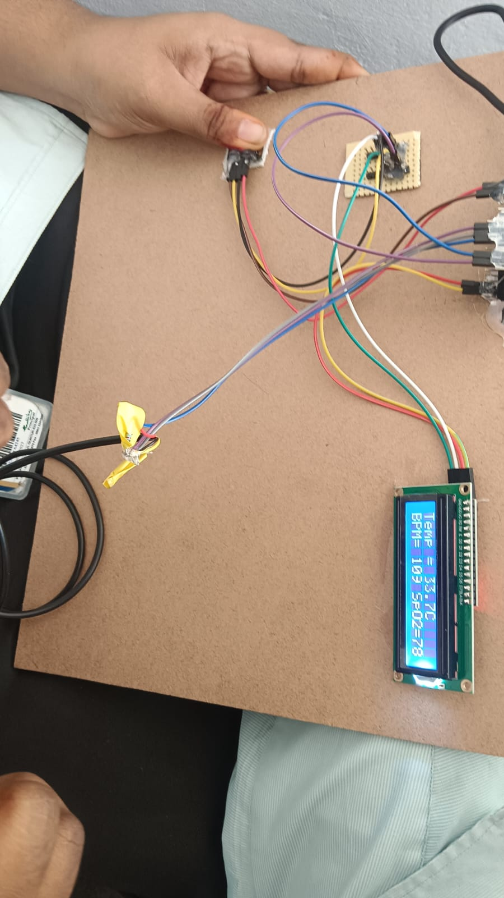

# 🏥 Smart Health Surveillance System Using Machine Learning & IoT
## 📖 Overview

The **Smart Health Surveillance System Using Machine Learning & IoT** is an intelligent healthcare monitoring application that combines **IoT**, **Machine Learning**, and **Web Development** to monitor a patient's health in real time.

The system uses an **ESP8266 NodeMCU** connected to the **MAX30100 Pulse Oximeter Sensor** and **DS18B20 Temperature Sensor** to collect vital health parameters such as:

- ❤️ Heart Rate (BPM)
- 🩸 Blood Oxygen Level (SpO₂)
- 🌡 Body Temperature

The collected sensor data is uploaded to **ThingSpeak Cloud** through Wi-Fi for real-time monitoring. A **Django Web Application** displays the health information through an interactive dashboard, while a **Random Forest Machine Learning model** analyzes the data to predict whether the patient's health condition is normal or abnormal.

---

# ✨ Features

- ❤️ Real-Time Heart Rate Monitoring
- 🩸 SpO₂ (Blood Oxygen) Monitoring
- 🌡 Body Temperature Monitoring
- 📟 Live Sensor Data Display on LCD 16×2
- ☁ Cloud Monitoring using ThingSpeak
- 🌐 Django Web Dashboard
- 🤖 Machine Learning Based Health Prediction
- 📊 Historical Data Visualization
- 📱 Remote Health Monitoring

---

# 🏗 System Architecture

```text
        Patient
           │
           ▼
 ┌───────────────────┐
 │ MAX30100 Sensor   │
 │ DS18B20 Sensor    │
 └───────────────────┘
           │
           ▼
   ESP8266 NodeMCU
           │
        Wi-Fi
           │
           ▼
   ThingSpeak Cloud
           │
           ▼
 Django Web Application
           │
           ▼
 Random Forest Model
           │
           ▼
 Health Status Prediction
```

---

# 🛠 Hardware Components

| Component | Description |
|-----------|-------------|
| ESP8266 NodeMCU | Wi-Fi Enabled Microcontroller |
| MAX30100 | Heart Rate & SpO₂ Sensor |
| DS18B20 | Temperature Sensor |
| LCD 16×2 | Displays Live Sensor Readings |
| Jumper Wires | Hardware Connections |
| USB Cable | Power Supply |

---

# 💻 Software & Technologies

### Programming Language

- Python
- Embedded C (Arduino)

### Framework

- Django

### Machine Learning

- Random Forest
- Scikit-learn
- Pandas
- NumPy

### IoT Platform

- ThingSpeak

### Database

- SQLite

### Development Tools

- Arduino IDE
- VS Code
- Git
- GitHub

---

# ⚙ Working

### Step 1

The MAX30100 sensor measures:

- Heart Rate (BPM)
- Blood Oxygen Level (SpO₂)

### Step 2

The DS18B20 sensor measures:

- Body Temperature

### Step 3

ESP8266 NodeMCU collects all sensor readings.

### Step 4

Sensor data is uploaded to ThingSpeak Cloud using Wi-Fi.

### Step 5

The Django application retrieves and displays the data.

### Step 6

The Random Forest Machine Learning model analyzes the collected data.

### Step 7

The system predicts whether the patient's health status is **Normal** or **Abnormal**.

---

# 📂 Project Structure

```
Smart-Health-Surveillance-System/
│
├── health_project/
├── templates/
├── static/
├── media/
├── Arduino_Code/
├── ml_model/
├── requirements.txt
├── manage.py
├── hardware.jpeg
└── README.md
```

---

# 🚀 Installation

### Clone Repository

```bash
git clone 
```

### Navigate to Project

```bash
cd Smart-Health-Surveillance-System-Using-Machine-Learning-IoT
```

### Install Required Packages

```bash
pip install -r requirements.txt
```

### Run Migrations

```bash
python manage.py migrate
```

### Start Server

```bash
python manage.py runserver
```

---

# 📊 Machine Learning

The project uses the **Random Forest Classifier** to analyze the collected health data.

### Input Features

- Heart Rate (BPM)
- SpO₂
- Body Temperature

### Output

- Normal
- Abnormal

Random Forest was selected because it provides:

- High Accuracy
- Better Generalization
- Reduced Overfitting
- Fast Prediction

---

# ☁ ThingSpeak Integration

ThingSpeak is used to

- Store sensor data
- Display real-time graphs
- Monitor patient health remotely
- Visualize historical readings

---

# 📸 Project Screenshots

## Hardware Setup

<p align="center">

</p>

> Add additional screenshots such as:
>
> - Django Dashboard
> - ThingSpeak Graphs
> - Prediction Result

---

# 🎯 Applications

- Smart Healthcare
- Hospitals
- Home Patient Monitoring
- Elderly Care
- Remote Healthcare
- Medical Research

---

# 🔮 Future Enhancements

- Mobile Application
- Doctor Dashboard
- Email & SMS Alerts
- AI-Based Disease Detection
- Cloud Database Integration
- Multi-Patient Monitoring
- PDF Health Report Generation

---

# 📚 Skills Demonstrated

- Python Programming
- Django Web Development
- Machine Learning
- Random Forest Algorithm
- Internet of Things (IoT)
- ESP8266 Programming
- Sensor Integration
- Cloud Computing
- Data Visualization

---

# 👩‍💻 Developer

**Nadiu Abhinaya**

🎓 B.Tech – Artificial Intelligence & Machine Learning

🏫 Vignan's Nirula Institute of Technology and Science for Women (VNITSW), Guntur

---

# ⭐ Support

If you found this project helpful, please consider giving it a ⭐ on GitHub!

---

# 📄 License

This project is developed for educational and academic purposes.
